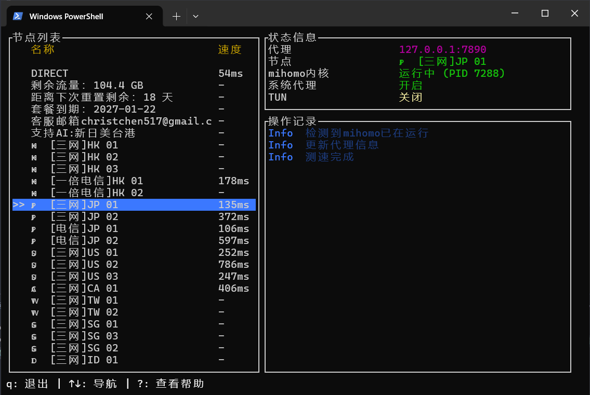
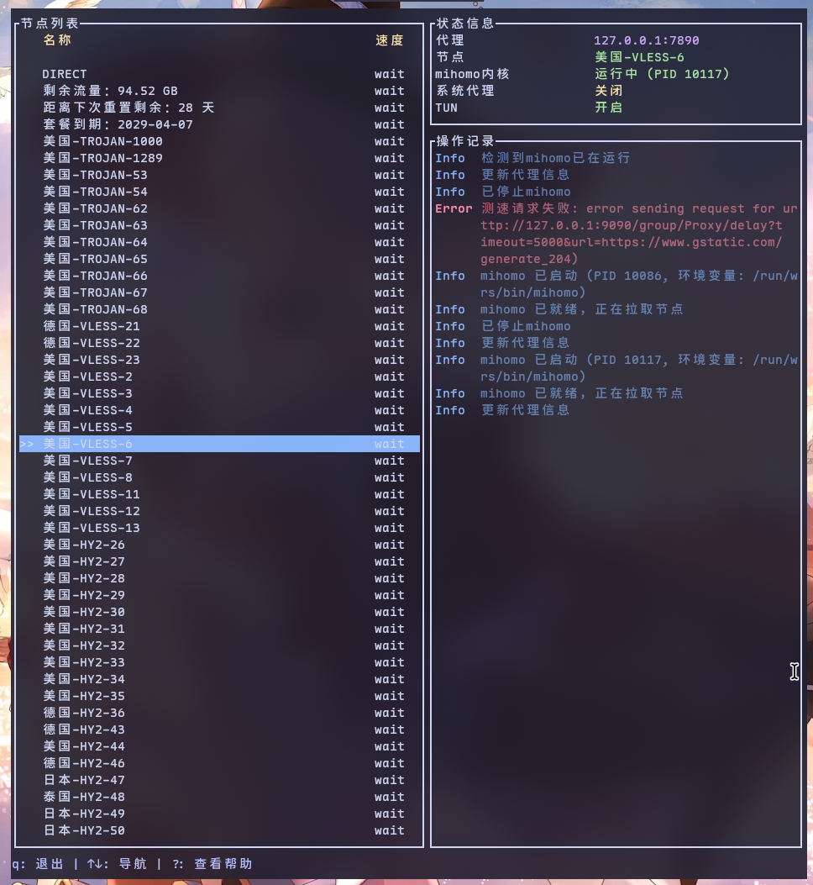

## 介绍

这是基于mihomo内核的tui。

支持系统代理与tun模式。

在windows上应该基本可用，linux上需要自己修改环境变量，然后source。

> 做这玩意的契机是，我主用的系统的nixos，不知道为什么会clash verge rev有时候会抽风，导入不了url，于是我打算自己玩mihomo内核。
>
> 但是发现自己解决不了linux的系统代理热切换。只能修改linux的系统代理，然后mihomo开了不关QWQ.

## 安装

### windows

先留个`todo`暂时没做安装脚本喵。

### nixos

```nix
# flake 输入
inputs.teclash.url = "github:rimyn/teclash";

# configuration.nix
imports = [ inputs.teclash.nixosModules.default ];
programs.teclash.enable = true;
```

`enable` 后默认会给mihomo提供sudo权限，不需要再`sudo`给`teclash`了。

### archlinux以及其他发行版

`todo`📒✍️

## 用法

首次进入`teclash`的时候，`mihomo`启动了≠能用了，如果发现读取`mihomo`端口失败了，说明`mihomo`还没有下载`GeoSite`数据库，需要等待一段时间下载数据库。

### Geo 数据源

GeoIP/GeoSite 默认从国内可达的 jsDelivr 镜像（`testingcf.jsdelivr.net`）下载，可在 `{config_dir}/teclash/config.yaml` 的 `geox-url` 字段自行更换（`geoip` / `geosite` / `mmdb` 三个键）。

### 进程管理

- TUI 关闭时**不会**杀掉 mihomo 进程（进程与 TUI 解耦）。
- 由 TUI 启动的 mihomo 会把 PID 记录在 `{config_dir}/teclash/mihomo.pid`，按 `s` 停止时只杀掉有 PID 记录的实例；外部启动的 mihomo（无 PID 记录）不会被误杀，需自行关闭。
- 启动失败但进程残留时（端口未就绪），仍可按 `s` 停止。
- mihomo 进程的 stdout/stderr 会写入 `{config_dir}/teclash/mihomo.log`，按 `l` 可在 TUI 内查看。

## 界面展示

1. windows中



2. linux中



## TODO

1. ~~添加tun模式。~~
2. 提供mihomo自动安装方案。
3. ~~打nix包。~~
4. ~~静默启动。~~
5. ~~mihomo的进程和tui解耦，关闭tui不关闭mihomo~~
6. 提供直连、规则、端口等修改。
